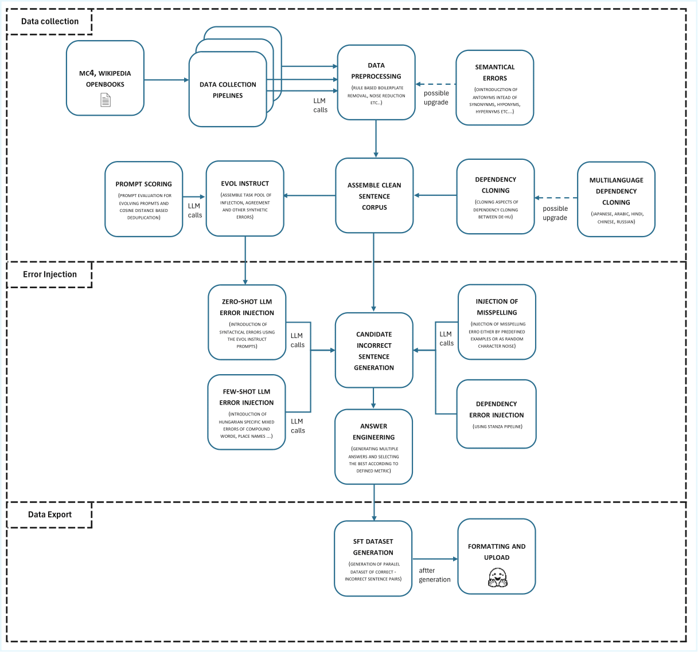

# hunGECsmall – Synthetic Hungarian GEC Dataset


This repository contains code for generating **hunGECsmall**, a synthetic Hungarian Grammatical Error Correction (GEC) corpus and exporting it in Hugging Face TRL *conversational* SFT format.

The final dataset itself is published on Hugging Face as:

- `MarkSikos2000/hunGECsmall`

This repository contains:

- standalone scripts for **data collection + cleaning**
- a multi-branch **error–injection pipeline** that produces (correct, incorrect) pairs with metadata
- a **formatter** that converts these pairs to TRL conversational SFT JSONL

## Code license
------------
The source code in this repository is licensed under the MIT License.

## Dataset license (research-only)
-------------------------------
The hunGECsmall synthetic dataset and any derivatives of the generated data
are provided strictly for non-commercial research and educational use only.

You may:
- Download, use and analyse the dataset for research and teaching.
- Publish results based on analyses of the dataset, provided you cite the dataset.

You may NOT:
- Use the dataset or its derivatives for commercial purposes.
- Redistribute the dataset as part of a commercial product or service.

---

## Supported Tasks

- **Grammatical Error Correction (GEC)** in Hungarian  
- **Supervised Fine-Tuning (SFT)** in TRL conversational format  

Recommended usage:

- `SFTTrainer` / `trl` conversational SFT  
- Any chat-style model expecting messages of the form `[{role, content}, ...]`

---

## Repository structure

Top-level layout:

- `src/`
  - `data/` – all intermediate and final `.jsonl` artifacts are written here  
    (usually not tracked in git)
  - `dataset_preparation/` – **standalone scripts** for collecting and cleaning base corpora  
    (mC4, Wikipedia, OPUS Books)
  - `grammatical_error_scripts/` – error-injection logic (GEC pair generation)
  - `prompt_engineering/` – Evol-Instruct style task generation + answer scoring
  - `utilities/` – shared config, LLM client wrapper, TRL formatter, etc.
  - `main.py` – optional entry point for experiments

---

## Data sources and preprocessing

The base **correct** sentences come from three sources:

1. Hungarian portion of **mC4** (web-scale, noisy)
2. **Hungarian Wikipedia** (2023 dump, cleaner)
3. **OPUS Books de–hu** sentence pairs (for cross-lingual experiments)

Each source is processed by a **standalone script** in `src/dataset_preparation/`:

- boilerplate removal, sentence splitting  
- whitespace / punctuation normalization  
- filtering obvious noise (cookie banners, URLs, emojis, heavy numeric lines, non-Hungarian text)  
- optional LLM-based filtering + minimal correction so the result can serve as *gold* “correct” text  
- semantic de-duplication using sentence embeddings (SBERT + cosine similarity)

All cleaned Hungarian sentences are merged into

- `src/data/clean_hu_sentences.jsonl`

Additionally, a list of common Hungarian misspellings is built from a Wikipedia page via:

- scraping + offline parsing of wrong–right word pairs
- LLM-based filtering of non-lexical entries

The curated misspelling dictionary is stored as

- `src/data/wiki_misspellings.cleaned.jsonl`

---

## Error–injection pipeline

Given a clean sentence, the pipeline produces **exactly one** incorrect variant plus metadata.

Main components (under `src/grammatical_error_scripts/` and `src/prompt_engineering/`):

### 1. Inflection / agreement / syntax errors (EVOL-Instruct, LLM)

- A small set of **seed error tasks** (agreement, case suffixes, word order, punctuation, etc.) is defined.
- These are evolved *in depth* and *in breadth* using an Evol-Instruct style procedure.
- New tasks are kept only if  
  - they are not near-duplicates of existing ones, and  
  - they pass automatic evaluation on held-out sentences (changed but recognisable sentence, reasonable length/change ratios).
- This yields a pool of ~40 validated task descriptions.

### 2. Hungarian-specific “mixed” errors (few-shot LLM)

- A single few-shot prompt encodes concrete Hungarian rules (compound words, institution names, dates, numbers, etc.).
- The model produces realistic mixtures of spacing, hyphenation, capitalization and agreement errors.

### 3. Cross-lingual dependency-based errors (rule-based)

- Using OPUS de–hu pairs and dependency parses, German main-verb positions are mirrored into Hungarian.
- This simulates learner-type word-order errors: unnatural but understandable Hungarian sentences.
- This branch is intentionally small and mainly illustrates a direction for future work.

### 4. Character-level typos (rule-based)

- Swap / drop / accent-removal operations + explicit **j/ly** confusions simulate random typos and noisy OCR.
- Applied with a fixed probability per sentence.

### 5. Frequent Hungarian misspellings (dictionary-based)

- When a sentence contains a “correct” form from the curated dictionary, it can be replaced by one of its typical misspellings with some probability.

### Answer engineering

For LLM-based branches that generate **multiple** candidates, simple scoring is applied:

- similarity to the original sentence  
- length ratio  
- amount of token-level change  

The highest-scoring candidate is kept. The main generator (`main.py`) orchestrates all branches and writes:

- `src/data/gec_pairs_step2.jsonl` – list of  
  `{ "id", "correct", "incorrect", "meta" }` records

---

## Final TRL SFT formatting

The last step converts GEC pairs into TRL conversational SFT format:

- script: `src/utilities/hf_formatter.py`  
- output: `src/data/gec_sft.jsonl`

Each record contains:

- `prompt`: one user message in Hungarian + the incorrect sentence  
- `completion`: one assistant message with the corrected sentence  
- `meta`: the original `correct` / `incorrect` fields and generation metadata (`gen_meta`)

This JSONL file is what is uploaded to Hugging Face as the dataset.

---

## Dependencies

The core generation pipeline is written in Python and relies on a few standard NLP / LLM libraries.

Tested with **Python 3.10** and the following packages:

- `datasets` – loading mC4, Wikipedia, OPUS Books
- `stanza` – dependency parsing for cross-lingual / syntactic errors
- `sentence-transformers` – SBERT embeddings for semantic deduplication
- `torch` – backend for sentence-transformers
- `openai` – calling the LLM endpoint for error generation / cleaning
- `requests`, `beautifulsoup4` – scraping and parsing the Hungarian Wikipedia typo list
- `scikit-learn` – cosine similarity and basic utilities

You can either recreate the environment from your own setup, or install the minimal dependencies with:

```bash
pip install datasets stanza sentence-transformers torch openai requests beautifulsoup4 scikit-learn
```

## How to run locally

Assume you cloned the repo and are in the project root:

```bash
git clone https://github.com/MarkSikos/hunGECsmall.git
cd hunGECsmall/src
```


1. **Set up environment**

   - Python 3.10+  
   - Install dependencies (Transformers, TRL, sentence-transformers, Stanza, BeautifulSoup, requests, etc.).  
   - Configure LLM credentials for `utilities/llm_client.py` (env vars, `.env`, or your preferred method).

2. **Build misspelling dictionary (optional but recommended)**

   ```bash
   python dataset_preparation/build_dict.py
   python grammatical_error_scripts/llm_clean_misspellings.py
   ```

3. **Collect and clean base corpora**  
   (Exact script names may differ slightly depending on your version.)

   ```bash
   # mC4 + Wikipedia
   python dataset_preparation/collect_corpus_mc4.py
   python dataset_preparation/collect_corpus_wiki.py

   # OPUS Books de–hu for cross-lingual errors
   python dataset_preparation/collect_corpus_opus.py
   ```

   After this, `data/clean_hu_sentences.jsonl` should exist.

4. **Generate GEC pairs**

   ```bash
   python grammatical_error_scripts/generate_errors.py
   ```

   This writes `data/gec_pairs_step2.jsonl`.

5. **Format to TRL conversational SFT**

   ```bash
   python utilities/hf_formatter.py
   ```

   This produces `data/gec_sft.jsonl`, which you can upload directly as a Hugging Face dataset.

---

## Using the dataset with TRL

Minimal example with `trl.SFTTrainer`:

```python
from datasets import load_dataset
from trl import SFTTrainer

ds = load_dataset("MarkSikos2000/hunGECsmall", split="train")

trainer = SFTTrainer(
    model="your-hf-chat-model",
    train_dataset=ds,
    dataset_text_field=None,   # conversational format
    formatting_func=None,      # TRL expects [{role, content}, ...]
)
trainer.train()
```

---

## Pipeline diagram

A schematic overview of the pipeline (data sources → cleaning → error injection → TRL formatting):



## Acknowledgements / inspiration

This project is loosely inspired by prior work on grammatical error generation and GEC data augmentation, some of them:

- Rei et al., *Artificial Error Generation with Machine Translation and Syntactic Patterns* (BEA 2017).  
- *Synthetic Hungarian GEC Corpus via Multi-Stage Error Injection* (arXiv:2509.14504).

